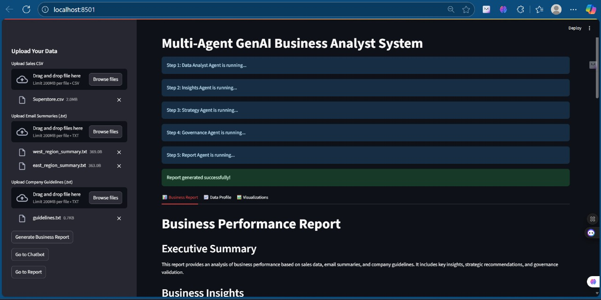
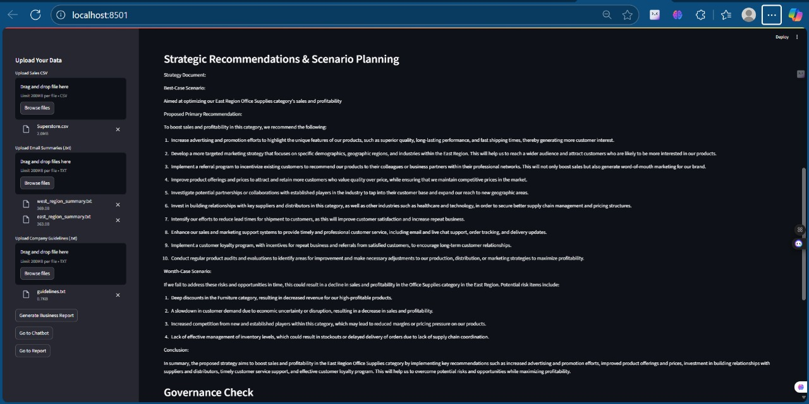
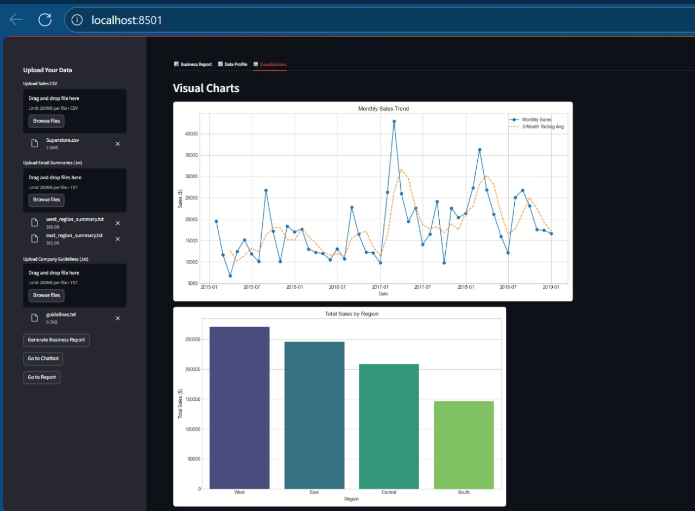
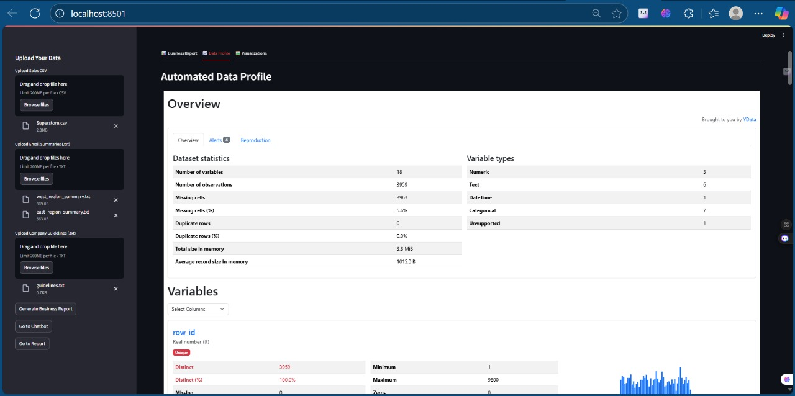
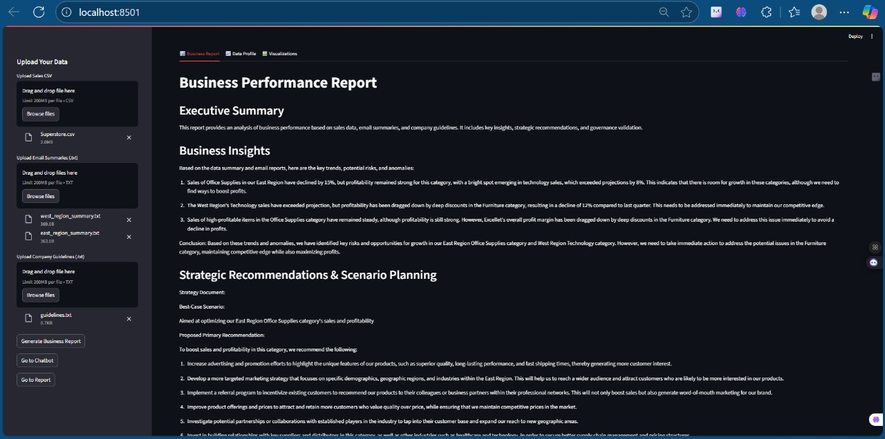
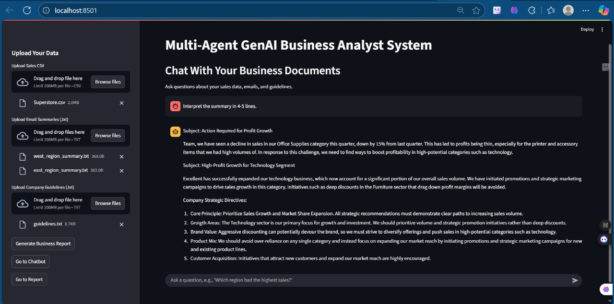

# Multi-Agent GenAI Business Analyst System

A fully autonomous, multi-agent system powered by open-source local LLMs that delivers real-time business insights, strategic recommendations, and governance validation — all through a user-friendly Streamlit web interface.

This project simulates an internal AI analyst team by chaining together specialized agents. It processes structured sales data (CSV), unstructured email summaries, and internal strategy guidelines to produce a polished, data-driven business report with visualizations. It is designed to run entirely on your local machine, ensuring data privacy and offline capability. Also features a user-friendly Streamlit web application with a tabbed interface for both guided analysis and ad-hoc questioning via a built-in chatbot.

---

## ✨ Core Features

- **Autonomous Agent Pipeline**: A multi-agent system where each agent performs a specific analytical role, from data processing to report generation.
- **Local LLM Integration**: Powered by Ollama, allowing you to run powerful models like Llama 3, Mistral, and Gemma locally and for free.
- **Hybrid Data Processing**: Ingests and analyzes both structured `.csv` sales data and unstructured `.txt` email reports.
- **RAG-Powered Governance**: Uses a Retrieval-Augmented Generation (RAG) system to validate strategic recommendations against custom company guidelines.
- **Dynamic Visualizations**: Automatically generates and embeds key charts (e.g., Sales by Region, Sales by Category) into the final report.
- **Interactive Web UI**: A clean, easy-to-use interface built with Streamlit for file uploads and report display.

---

## ⚙️ System Architecture

The system follows a multi-agent design, where each agent passes its output to the next in a logical pipeline, simulating a real-world business analysis workflow.

| Agent                | Role                                                                             |
| -------------------- | -------------------------------------------------------------------------------- |
| **Data Analyst**     | Loads and preprocesses CSV and email data, summarizing key figures.              |
| **Insights Agent**   | Uses an LLM to analyze trends, anomalies, and risks from the summary.            |
| **Strategy Agent**   | Generates actionable strategic recommendations based on the identified insights. |
| **Governance Agent** | Validates the recommendations against internal policies using RAG and an LLM.    |
| **Report Agent**     | Compiles all outputs into a final Markdown report with business visualizations.  |

---

## 🛠️ Tech Stack

- **LLM Backend**: [Ollama](https://ollama.ai) (with `tinyllama`, `gemma:2b`, or `mistral`)
- **Agent & RAG Logic**: Python, LangChain
- **Vector Store**: FAISS
- **Web Interface**: Streamlit
- **Data Manipulation**: Pandas
- **Charts & Visuals**: Matplotlib, Seaborn

---

## 📂 Folder Structure

```
multi-agent-genai-analyst/
├── Agents/
│   ├── __init__.py
│   ├── data_analyst.py
│   ├── insights_agent.py
│   ├── strategy_agent.py
│   ├── governance_agent.py
│   └── report_agent.py
├── data/
│   ├── Superstore.csv
│   ├── emails/
│   │   ├── east_region_summary.txt
│   │   └── west_region_summary.txt
│   └── guidelines.txt
├── output/
│   ├── final_report.md
│   └── (generated_charts.png)
├── app.py              # Streamlit Web Interface
├── llm.py              # Central LLM interaction logic
├── chatbot.py          #in-built Chatbot
└── requirements.txt
```

---

## 🚀 How to Run

Follow these steps to set up and run the project on your local machine.

### 1. Prerequisites

- Python 3.8+
- Git

### 2. Clone the Repository

```bash
git clone https://github.com/yourusername/multi-agent-genai-analyst.git
cd multi-agent-genai-analyst
```

### 3. Set Up a Virtual Environment

It's highly recommended to use a virtual environment.

```bash
# Create the environment
python -m venv venv

# Activate it
# On Windows:
.\venv\Scripts\activate

# On macOS/Linux:
source venv/bin/activate
```

### 4. Install Dependencies

Install all required Python packages from the `requirements.txt` file.

```bash
pip install -r requirements.txt
```

### 5. Set Up Ollama and Download a Model

This project relies on a locally running LLM via Ollama.

- **Install Ollama**: Follow the instructions on the official [Ollama website](https://ollama.ai).
- **Download a Model**: We recommend starting with a small model for a fast setup.

```bash
ollama run tinyllama
```

This will download the \~600MB model and start the Ollama server. Leave this terminal running in the background.

> **Note**: The project is pre-configured for `tinyllama`. You can upgrade to a more powerful model like `mistral` later.

### 6. Prepare Your Input Data

Create a `data` directory with the necessary files. Sample content is provided below.

- `data/Superstore.csv`: Download a sales dataset. It must contain at least **Order Date, Sales, Region, and Category** columns.

  - A compatible version can be found on [Kaggle](https://www.kaggle.com/).

- `data/emails/`: Create this subdirectory.

  - `data/emails/east_region_summary.txt`:
    ```txt
    Subject: Tough Quarter for East Region Office Supplies
    Team, we saw a significant dip in sales for our Office Supplies category this quarter, down 15%. Furniture sales remain steady. Technology sales are a bright spot, up 8%.
    ```

- `data/guidelines.txt`:

  ```txt
  Company Strategic Directives:
  1. Core Principle: Prioritize Sales Growth and Market Share Expansion.
  2. Growth Areas: The Technology sector is our primary focus for growth.
  3. Brand Value: Aggressive discounting is discouraged.
  4. Customer Acquisition: Initiatives that attract new customers are highly encouraged.
  ```

### 7. Run the Streamlit Web App

Launch the application using the following command in your terminal:

```bash
streamlit run app.py
```

Your web browser will automatically open a new tab with the application interface. Use the sidebar to upload your `Superstore.csv`, email `.txt` files, and `guidelines.txt`, then click **"Generate Business Report"**.

---

// ...existing code...

## 📸 Sample Images Of the Project

### Streamlit Web Interface


### Strategy Agent Report


### Data Visualizations


### Data Profiling


### Agent Output


### Chatbot Interface


---


## 🧠 Switching to a More Powerful Model

To improve the quality of the generated insights, you can switch to a more powerful model like `mistral` or `gemma:2b`.

- Download the new model:

  ```bash
  ollama run mistral
  ```

- Update the model name in two files:

  - In `llm.py`, change

    ```python
    model='tinyllama'
    ```

    to

    ```python
    model='mistral'
    ```

  - In `Agents/governance_agent.py`, change

    ```python
    OllamaEmbeddings(model="tinyllama")
    ```

    to

    ```python
    OllamaEmbeddings(model="mistral")
    ```

---

## 📜 License

This project is licensed under the **MIT License**. See the [LICENSE](./LICENSE) file for details.

